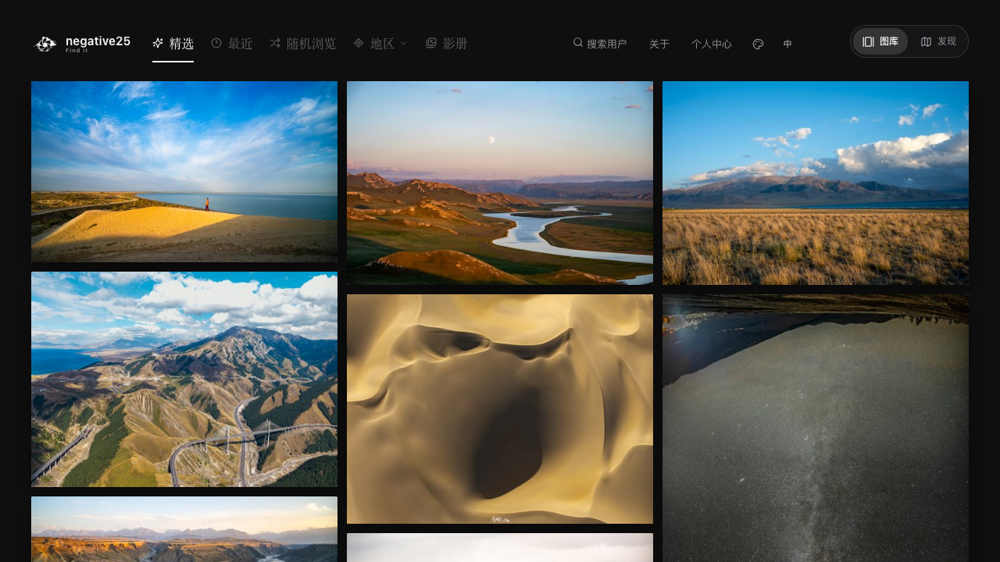
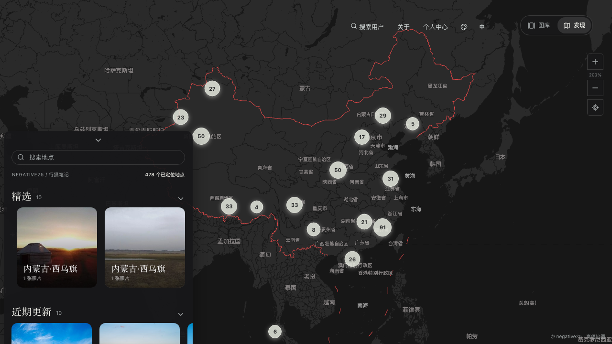
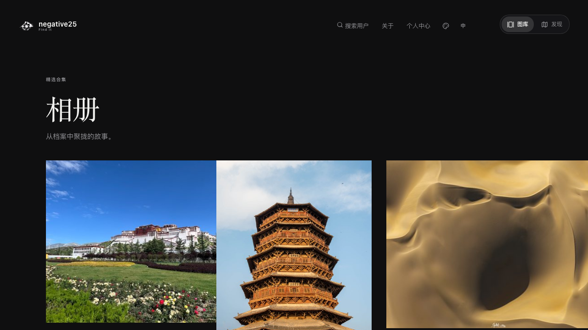
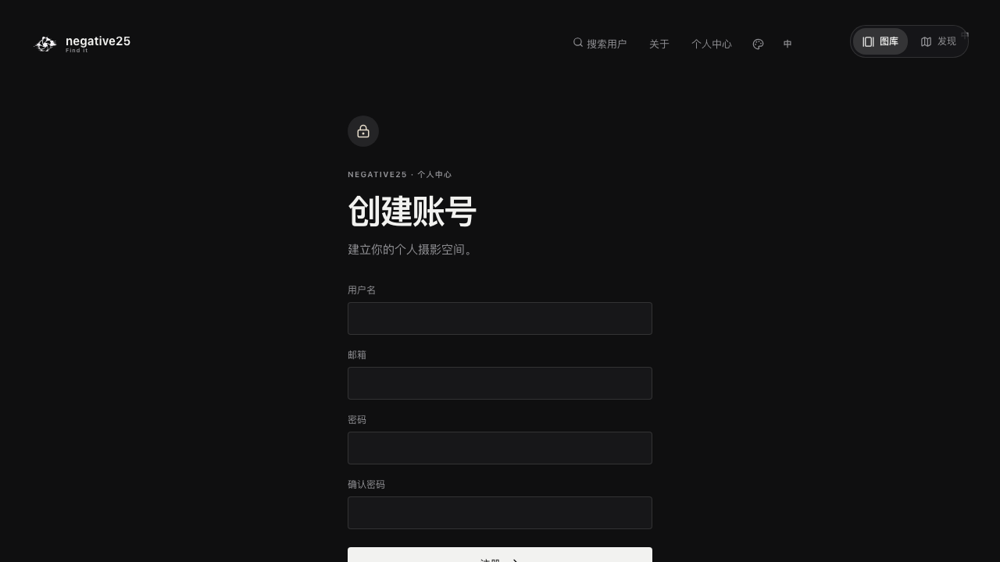
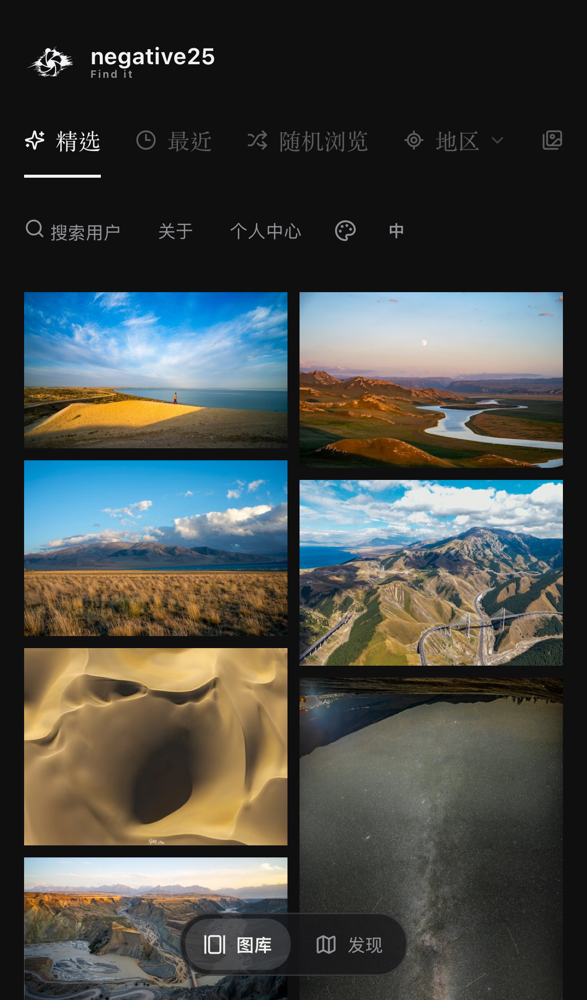
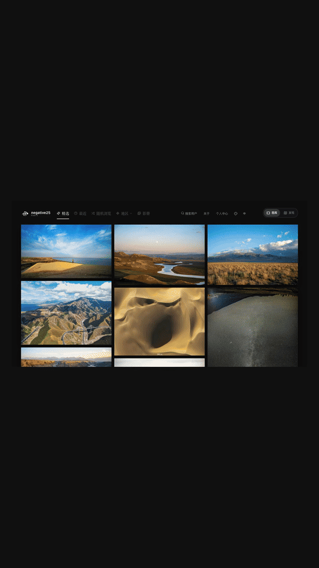
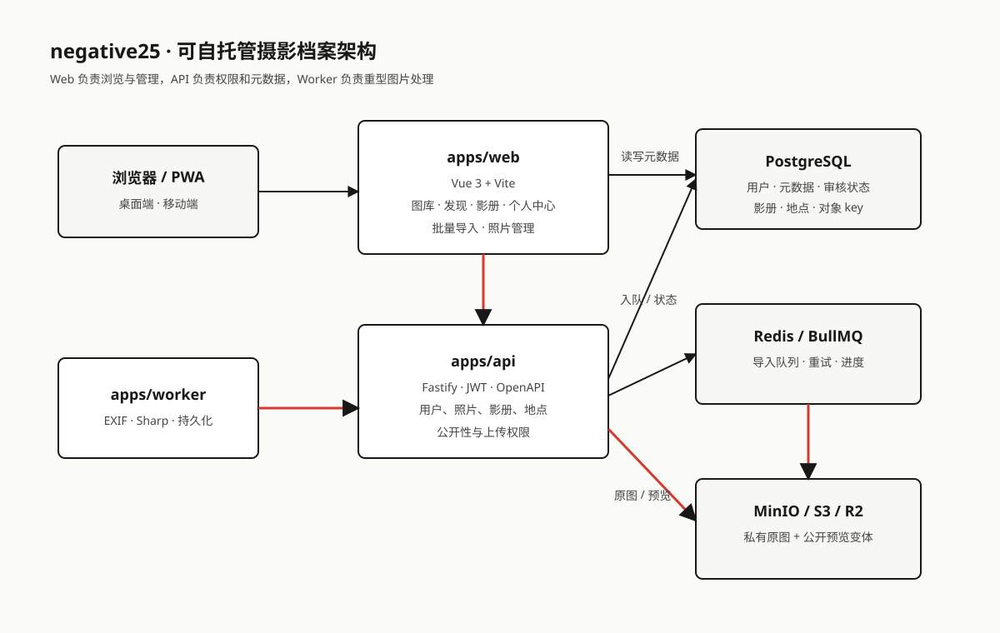

# negative25

> **Don't just dream it, live it. Find your negative 25.**

一个面向摄影师和影像爱好者的开源摄影档案馆：把照片、拍摄参数、地点和个人故事放在同一个可持续整理的空间里。

<p>
  <a href="https://n25.world/"><strong>在线演示</strong></a> ·
  <a href="docs/README.en.md">English</a> ·
  <a href="docs/DEMO.md">产品导览</a> ·
  <a href="docs/OPEN_SOURCE.md">开源说明</a> ·
  <a href="CONTRIBUTING.md">参与贡献</a>
</p>



## 这是什么？

negative25 是一个可自托管的多用户摄影作品平台。它不只展示图片，也保留图片背后的证据：相机、焦距、光圈、快门、ISO、拍摄时间、海拔、经纬度和地点地图。

你可以把它当成：

- 一个支持 EXIF 自动读取的大批量照片归档工具；
- 一个拥有公开主页和影册的个人摄影档案；
- 一个按评分、时间、地区和地图探索作品的公开图库；
- 一个可以使用 MinIO 起步，并平滑迁移到 Cloudflare R2 的对象存储应用。

## 产品一览

| 模块 | 能力 |
| --- | --- |
| 图库 | 精选、最近、随机浏览、地区筛选和响应式瀑布流 |
| 发现 | 世界地图、聚合点、地点面板和位置照片浏览 |
| 影册 | 多张封面堆叠、展开排列、拍摄日期和相册详情 |
| 照片档案 | EXIF、焦距、光圈、快门、ISO、海拔、经纬度、地图和七星评级 |
| 多用户 | 用户名/密码注册、公开主页、用户搜索和公开影册浏览 |
| 管理中心 | 分批导入、EXIF 处理、批量定位/评分/复制状态、单张或批量删除 |
| 大文件上传 | 批量选择、分片/预签名上传、队列处理和失败重试 |
| 存储 | PostgreSQL 元数据、Redis 队列、MinIO 私有原图和公开预览变体 |
| 设备 | 桌面端、移动端和 PWA 响应式界面 |

## 产品导览

### 首页：按摄影习惯浏览

精选按评分排序，最近按拍摄时间排序，随机浏览使用独立随机序列。用户还可以按地区进入省、市或国家的作品集合。

### 发现：从地图回到照片

发现模块使用真实地图底图承载照片位置。聚合圆点显示地点照片数量，点击地点后可直接查看对应照片；没有坐标的照片会保留在未定位集合中，不会被静默丢弃。



### 影册：按故事组织作品

影册以封面和拍摄时间组织照片，适合整理旅行、项目或长期主题。桌面和移动端都使用自适应布局。



### 多用户：公开主页和私有管理

每个用户默认拥有公开主页。未登录访客看到的是经管理员审核的默认公开照片；其他用户只有在被搜索到后，才会展示其已公开的影册和照片。个人中心始终属于当前登录用户。



### 移动端

核心图库、影册和发现地图均针对窄屏重新排版，照片比例自适应，不依赖固定卡片尺寸。



## 演示视频

仓库内提供一段由线上真实界面截图制作的产品导览：

[观看 negative25 产品导览视频](docs/media/negative25-product-tour.mp4)

视频重点展示首页图库、发现地图、影册和移动端布局；截图只用于产品展示，不包含原始照片文件、账号密钥或服务器配置。



[产品导览封面](docs/media/negative25-product-tour-cover.svg) · [字幕](docs/media/negative25-product-tour.srt) · [脚本说明](docs/media/negative25-product-tour-script.md)

## 架构



- `apps/web`：Vue 3 + Vite 前端、图库、发现、影册、用户主页和管理中心。
- `apps/api`：Fastify API、认证、公开空间、照片、影册、地点和导入接口。
- `apps/worker`：异步队列、EXIF 解析、Sharp 图片变体生成和对象存储持久化。
- `packages/contracts`：前后端共享的数据契约和 API 类型。
- `packages/config`、`packages/utils`：环境变量校验、错误处理和海拔等通用能力。
- PostgreSQL 保存用户、照片元数据、影册、地点和审核状态；Redis/BullMQ 负责导入任务；MinIO 或 R2 保存二进制文件。

更详细的流程见 [`docs/DEMO.md`](docs/DEMO.md) 和 [`infra/README.md`](infra/README.md)。

## 技术栈

`Vue 3` · `TypeScript` · `Vite` · `Fastify` · `PostgreSQL` · `Redis` · `BullMQ` · `Sharp` · `MinIO / S3 / Cloudflare R2` · `Playwright` · `Docker Compose`

## 快速开始

需要 Node.js 22+、pnpm 11+ 和 Docker Desktop。

```bash
pnpm install
cp .env.example .env
docker compose up -d
pnpm db:migrate
pnpm dev
```

默认开发地址：

- Web：`http://localhost:5173`
- API：`http://localhost:3000`
- MinIO Console：`http://localhost:9001`

如果只想浏览前端空状态，可以把 `N25_USE_DATABASE=0`，不启动数据库也能运行演示适配器。

## 环境变量和密钥

环境变量模板：

- [`.env.example`](.env.example)：本地开发
- [`infra/production.env.example`](infra/production.env.example)：生产部署

真实的 JWT 密钥、数据库密码、MinIO/R2 密钥、高德地图 Key 和 GitHub Token 只能放在本地 `.env`、服务器 Secret Manager 或 CI Secrets 中，绝不能提交到仓库。

| 变量 | 用途 |
| --- | --- |
| `DATABASE_URL` | PostgreSQL 连接串 |
| `REDIS_URL` | Redis/BullMQ 连接串 |
| `S3_ENDPOINT` | API/Worker 访问的内部 S3 兼容端点 |
| `S3_PUBLIC_ENDPOINT` | 浏览器能访问的预签名地址端点 |
| `S3_PUBLIC_BASE_URL` | 公开预览/CDN 前缀 |
| `S3_BUCKET` | 原图和预览变体所在 bucket |
| `VITE_AMAP_KEY` | 前端地图 Key，占位符即可提交 |
| `JWT_SECRET`、`JWT_REFRESH_SECRET` | 登录会话签名密钥 |

## MinIO 与 Cloudflare R2

应用通过 S3 兼容接口访问对象存储，业务层不依赖 MinIO 专属 API。因此可以先使用 MinIO，之后将原图和预览变体同步到 R2，修改端点和凭据，并保持数据库中的对象 key 不变。

迁移前请完成对象校验、双写或停机切换、回滚备份和公开 URL 验证。原图建议始终保持私有，只公开 `thumbnail`、`preview` 和 `large` 变体。

## 生产部署

生产部署由 Web、API、Worker、PostgreSQL、Redis 和对象存储组成。参考 [`infra/README.md`](infra/README.md)：

```bash
cp infra/production.env.example .env.production
# 在 Secret Manager 或服务器环境中填写真实值
pnpm db:migrate
docker compose -f docker-compose.production.yml --env-file .env.production up -d --build
```

上线前检查：`/health`、`/api/v1/health`、公开图库、预签名上传地址、一个缩略图 URL 和一个完整导入批次。数据库与对象存储应分别备份，失败的图片变体任务不能删除原图。

## 测试与质量检查

```bash
pnpm lint
pnpm typecheck
pnpm test
pnpm build
pnpm test:e2e
pnpm test:visual
```

提交前请确认没有真实密钥、账号信息、原始用户照片或服务器配置进入 Git。安全问题请看 [`SECURITY.md`](SECURITY.md)。

## 开源协作

- 行为规范：[`CODE_OF_CONDUCT.md`](CODE_OF_CONDUCT.md)
- 贡献指南：[`CONTRIBUTING.md`](CONTRIBUTING.md)
- 安全报告：[`SECURITY.md`](SECURITY.md)
- 产品与文档说明：[`docs/OPEN_SOURCE.md`](docs/OPEN_SOURCE.md)
- Issue 模板：`.github/ISSUE_TEMPLATE/`

欢迎提交 bug、可复现的 UI 改进、地图适配、存储驱动和文档完善。涉及认证、公开性、原图权限和对象存储的改动，请同时补充测试和迁移说明。

## Roadmap

- [x] 多用户、公开主页和管理员审核
- [x] EXIF/位置/评分/影册/地图发现
- [x] MinIO、预签名地址和批量导入链路
- [x] 桌面端与移动端响应式布局
- [ ] 更完整的 R2 迁移工具和对象校验报告
- [ ] 邮件验证、找回密码和更细粒度的团队权限
- [ ] 可选的桌面同步客户端和 iOS 原生客户端

## License

本项目采用 [MIT License](LICENSE)。照片、Logo、地图 Key、部署密钥和用户内容不随软件许可证自动授权；使用者应自行确认素材、数据和第三方服务的权利。

## 分享项目

如果你也在整理自己的摄影档案，欢迎在 GitHub 上给项目点 Star、提出可复现问题，或分享你对公开影册、地图发现和对象存储迁移的实践经验。
